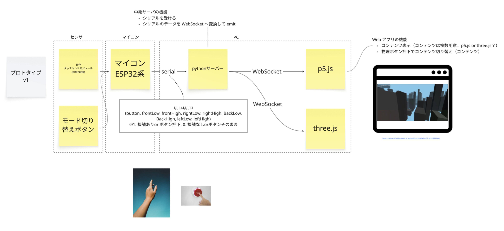

# 水コントローラー

HOMEWORKS 2026 出展作品「水コントローラー」のリポジトリ

## コンセプト

```md
# 水コントローラー

## 作品概要
水位計を利用して、水面の波を利用したコントローラーを作成し、そのコントローラーを使用したインタラクションコンテンツを展開する。
インタラクションの内容によってコントローラーとして触れる水の感じ方の変化を探る作品

## 展示方法

100×100×40の程度のトレイ型コントローラーとディスプレイを設置し、実際に触れて体験を行う形態で展示を行います。

## ステートメント

水は古代ギリシャの時代アルケー(万物の根源)として考えられていた。水は様々なモノを時に混ぜ、流し、運ぶ。如何様にも形態を変えてそこにある存在でもある。この水をコントロールする媒体としたとき、水そのものがもつ性質に触れることができるだろうか？コントローラーという支配、操作を行うための形態として水に触れるときその関係性は普遍的なものであるのだろうか？
```

## 環境

- Auduino 2.3.6（おそらく 2 系なら OK）
- Rust 1.90.x
- Node.js 22.21.x (おそらく 22 系なら OK)

## システム構成

ref: [2025.10.28 HOMEWORKS 2026 - 水コントローラー システム構成](https://miro.com/app/board/uXjVKH3yhHE=/?moveToWidget=3458764646019356328&cot=14)



## プロジェクト構造

- `water-controller-firmware`
  - 概要
    - 静電容量センサー（[Adafruit MPR121](https://www.switch-science.com/products/1867?srsltid=AfmBOopVHqa4pcuXX1mcOF-6RVSKLl7RrhzxnQegAAV37uN7NLxMTKxW)）の値（0 / 1）を取得し、シリアルポートに出力するファームウェア
  - 技術スタック
    - Arduino
      - Adafruit MPR121 1.2.0
      - j
- `water-controller-relay`
  - 概要
    - Arduino のシリアル通信を受信して、WebSocket でクライアントに配信する中継サーバ（リレーサーバ）
  - 技術スタック
    - Rust
- `water-controller-app`
  - 役割
    - ユーザコンテンツを提供するデスクトップアプリ
    - WebSocket で relay サーバと通信する
  - 技術スタック
    - TypeScript
    - Electron
    - p5.js
    - Three.js

## セットアップ

### Auduino のインストール

以下を参照：

https://support.arduino.cc/hc/en-us/articles/360019833020-Download-and-install-Arduino-IDE

### Rust のインストール

以下のリンクの手順に従って rustup をインストール：

https://rust-lang.org/ja/learn/get-started/

バージョンを確認：

```sh
cargo --version
# こんな感じで出力されれば OK
# cargo 1.90.0 (840b83a10 2025-07-30)
```

### Node.js のインストール

nvm（Node.js バージョンマネージャ）をインストールした後、Node.js v22.21.1 をインストールする：

ref: https://nodejs.org/en/download

```sh
# nvm をインストール
curl -o- https://raw.githubusercontent.com/nvm-sh/nvm/v0.40.3/install.sh | bash

# シェルを再起動する前に以下を実行
\. "$HOME/.nvm/nvm.sh"

# Node.js v22.21.1 をインストール
nvm install v22.21.1

# インストールされている Node.js の一覧
nvm ls

# Node.js v22.21.1 を使用する
nvm use v22.21.1

# Node.js v22.21.1 の確認
node -v # "v22.21.1" と出力されれば OK

# npm の確認
npm -v # "10.9.4" と出力されれば OK
```

pnpm をインストール：

```sh
# pnpm をインストール
npm install -g pnpm@latest-10

# pnpm のバージョン確認
pnpm -v # "10.x.x" と出力されれば OK
```

## 実行

### ファームウェア `water-controller-firmware`

1. マイコン（Arduino UNO R3）を PC に接続
2. Arduino IDE 経由でスケッチ `water-controller-firmware/WaterControllerFirmwareProto/WaterControllerFirmwareProto.ino` をコンパイルし、マイコンに書き込む
3. マイコンを起動する

### センサー中継サーバ `water-controller-relay`

作業ディレクトリへ移動：

```sh
cd water-controller-relay
```

以降、`water-controller-relay` ディレクトリで作業することを前提とする。

#### 開発環境

- 使用可能なシリアルデバイスの一覧

```sh
cargo run -- device-list
```

<details>
<summary>出力例：使用可能なシリアルデバイスの一覧</summary>

```txt
Listing available serial ports:
name: /dev/cu.SoundcoreLibertyAir2Pro, type=PciPort
name: /dev/tty.SoundcoreLibertyAir2Pro, type=PciPort
name: /dev/cu.HUAWEIFreeClip, type=PciPort
name: /dev/tty.HUAWEIFreeClip, type=PciPort
name: /dev/cu.Bluetooth-Incoming-Port, type=PciPort
name: /dev/tty.Bluetooth-Incoming-Port, type=PciPort
name: /dev/cu.usbmodem1101, type=UsbPort(UsbPortInfo { vid: 0x2341, pid: 0x0043, serial_number: Some("0353534333535160C0A3"), manufacturer: Some("Arduino (www.arduino.cc)"), product: None })
name: /dev/tty.usbmodem1101, type=UsbPort(UsbPortInfo { vid: 0x2341, pid: 0x0043, serial_number: Some("0353534333535160C0A3"), manufacturer: Some("Arduino (www.arduino.cc)"), product: None })
```

</details>

- 実行

```sh
cargo run -- --port "/dev/cu.usbmodem1101" --baud-rate 115200

# 省略形
cargo run -- -p "/dev/cu.usbmodem1101" -b 115200
```

- ヘルプ

```sh
cargo run -- help
```

#### 本番環境

- ビルド

```sh
cargo build --release
```

- 実行

```sh
./target/release/water-controller-relay -p "/dev/cu.usbmodem1101" -b 115200
```

```
