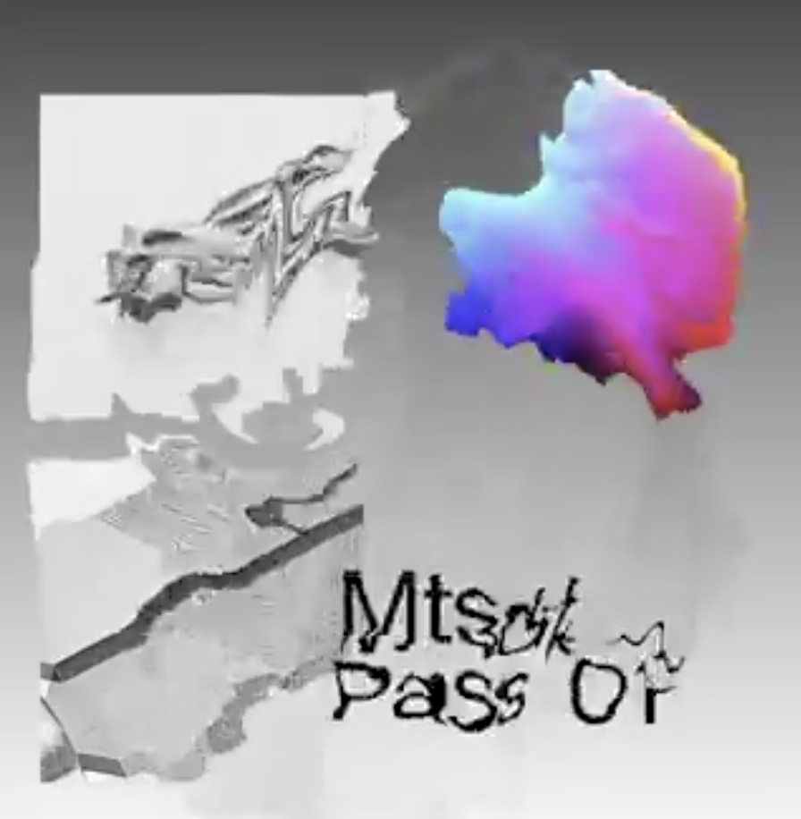
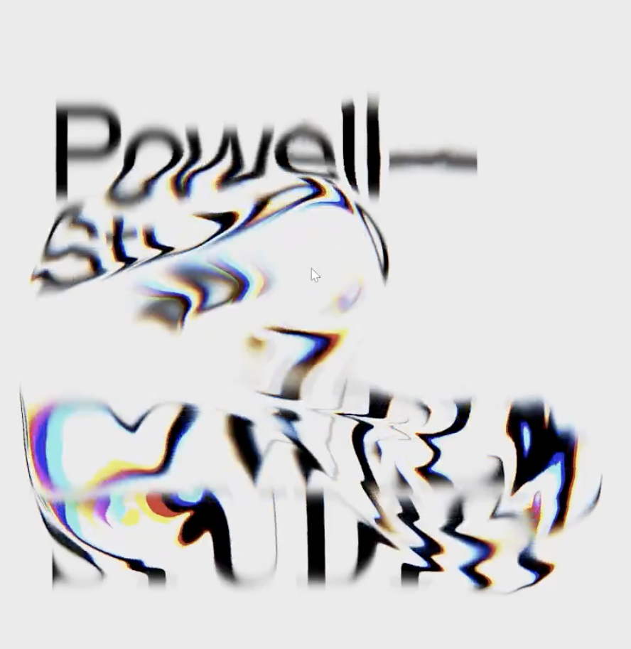
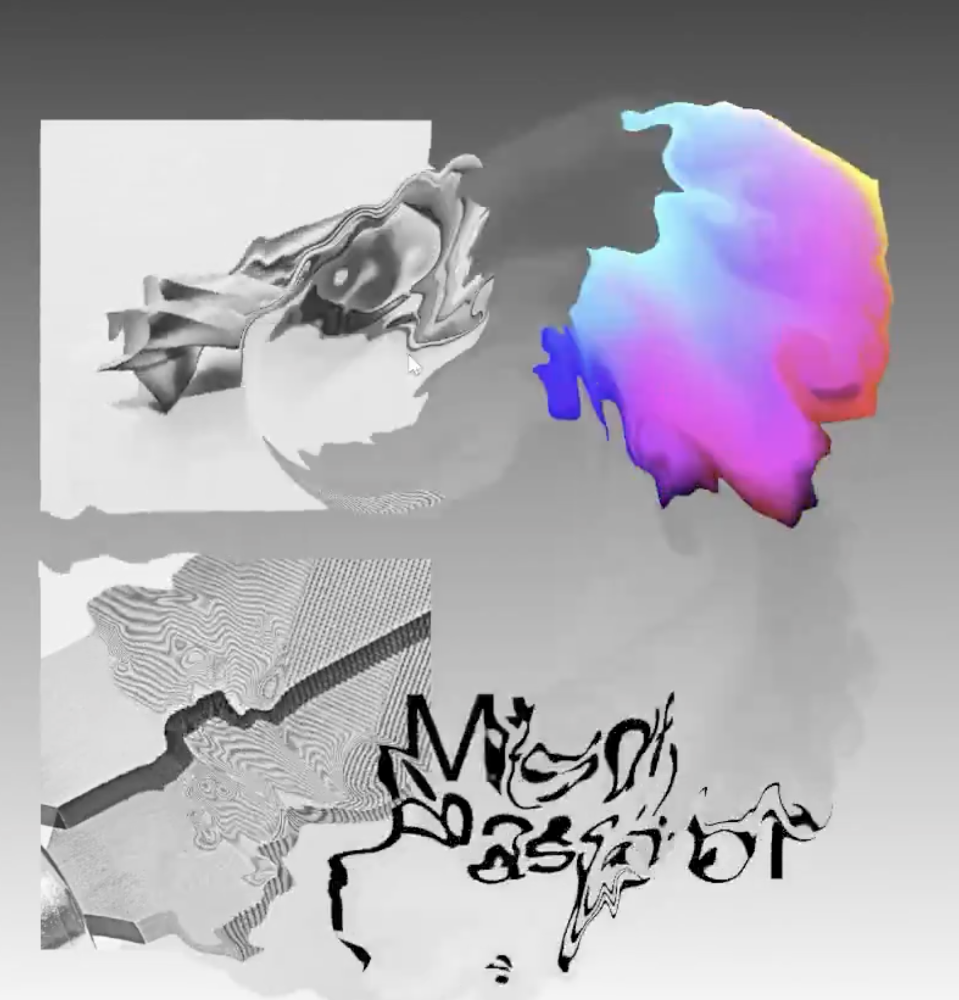
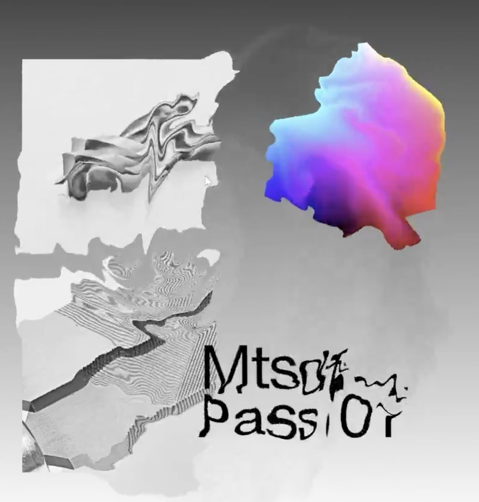

# タスク 03: エフェクトの余韻とにじみ効果

## ステータス

- **優先度**: 中
- **担当**: 開発側（パラメータ調整・シェーダー実装）
- **作成日**: 2026-02-09
- **更新日**: 2026-02-09
- **フェーズ**: 🚧 実装中

## 問題の概要

コントローラーの操作を止めるとエフェクトがすぐに消えてしまう。また、のっぺりした立方体の内部では動きが分かりにくい。以下の改善が必要：

1. **余韻を残す**: 波紋が長く残り、ゆっくりと消えていく
2. **にじみ効果**: カーソルが通った場所に不規則な「ぐちゃっとした」歪みが発生する
3. **視認性の向上**: 単色エリアでもエフェクトの動きが分かりやすい

### 重要な設計方針

**🎯 最優先事項**:

1. **エフェクトの局所性**: カーソル位置の周辺のみに影響を与え、遠くに広がりすぎない
   - 左端に触っても右端にはほとんど影響しない
   - 距離による減衰を実装
2. **長い持続時間**: エフェクトが5-7秒間残り続ける
   - 操作を止めても軌跡がしばらく残る
   - 複数の波紋が重なり合って豊かな視覚効果を生む

### 理想的な挙動

- 操作を止めても軌跡がしばらく残る
- **波紋が長く（5-7秒）残って余韻を感じる** ← 重要
- エフェクトがゆっくりと減衰していく
- **カーソル位置の周辺のみに局所的にエフェクトが発生** ← 重要
- 立方体の内部を通るときも歪みがはっきり見える
- 複数の波紋が重なり合って豊かな視覚効果を生む
- 円形の波紋構造を保ちつつ、輪郭が不規則にゴツゴツと変形する

## ビジュアルイメージ

以下の画像は、求めているエフェクトの「にじみ」やエフェクト後の「余韻」のイメージを表しています。









### イメージの説明

- **不規則なにじみ**: エッジだけでなく、立方体の内部でも歪みが見える
- **複雑なパターン**: ノイズによる「ぐちゃっとした」不規則な歪み
- **長い余韻**: エフェクトが滲むように残る
- **多重波紋**: 前のエフェクトの上にさらに新しいエフェクトが重なる

画像に描かれているような、カラフルな3Dオブジェクトから不規則な歪みが広がっていくような「にじみ」を表現したい。操作によって生まれたエフェクトが、すぐには消えずに画面上に留まり、徐々に薄くなっていくイメージ。

## 現在のパラメータ（初期状態）

### 波紋エフェクトの定数

```typescript
// src/renderer/src/constants.ts (初期状態)
export const RIPPLE_PARAMS = {
  MAX_TRAIL_POINTS: 24, // 記録する軌跡点の最大数
  TRAIL_INTERVAL: 0.03, // 軌跡点を追加する間隔（秒）
  RIPPLE_LIFETIME: 2.0, // 波紋の持続時間（秒） ← 短い
  RIPPLE_SPEED: 0.8, // 波紋の拡散速度
  MIN_DISTANCE: 0.02 // 軌跡点を追加する最小移動距離
} as const
```

### シェーダーパラメータ（初期状態）

```typescript
// LiquidGlassVideoEffect.tsx / LiquidGlassImageEffect.tsx
uniforms: {
  uRefractionStrength: { value: 0.015 }, // 屈折強度 ← 弱い
  uChromaticAberration: { value: 0.001 }, // 色収差 ← 強すぎる
  // ...
}
```

```glsl
// liquidGlass.frag.glsl (初期状態)

// 波の幅
float waveWidth = 0.15; // ← くっきりした円が見える

// 時間経過による減衰
float decay = 1.0 - (elapsed / uRippleLifetime);
decay = decay * decay; // 2乗 ← 急激に消える

// ノイズなし（シンプルな波紋のみ）
totalDistortion += waveDirection * radialDistortion * waveInfluence * uRefractionStrength;
```

## 関連する実装コード

### 1. 波紋の持続時間と減衰

```glsl
// liquidGlass.frag.glsl:108-112
// 時間経過による減衰
float decay = 1.0 - (elapsed / uRippleLifetime);
decay = decay * decay; // 2乗で急激に減衰

waveInfluence *= decay;
```

**影響**:

- `RIPPLE_LIFETIME = 2.0` の場合、2秒で完全に消える
- 2乗の減衰により後半は急激に薄くなる
- 余韻が感じられない

### 2. 軌跡点の管理

```typescript
// LiquidGlassVideoEffect.tsx:206-218
// 最大数を超えたら古いものを削除
if (trailPoints.length > RIPPLE_PARAMS.MAX_TRAIL_POINTS) {
  trailPoints.shift()
}

// 古い軌跡点を削除（寿命切れ）
while (
  trailPoints.length > 0 &&
  currentTime - trailPoints[0].time > RIPPLE_PARAMS.RIPPLE_LIFETIME
) {
  trailPoints.shift()
}
```

**影響**:

- `MAX_TRAIL_POINTS = 24` の場合、24個までしか記録されない
- 複雑な軌跡パターンが生成されにくい

### 3. 波紋の視覚効果

```glsl
// liquidGlass.frag.glsl:101-106
float waveWidth = 0.15;

// 波紋の影響（ガウス分布風）
float distanceFromWave = abs(dist - rippleRadius);
float waveInfluence = exp(-distanceFromWave * distanceFromWave / (waveWidth * waveWidth));
```

**影響**:

- `waveWidth = 0.15` の場合、波の輪郭がくっきり見える
- 時間とともに円形の輪郭が広がっていくのが見える

## 問題の原因分析

### 問題1: エフェクトがすぐに消える

**原因**:

1. 波紋の持続時間が短い（2.0秒）
2. 2乗の減衰カーブにより、後半は急激に消える
3. 軌跡点の数が少ない（24個）ため、長い軌跡が描けない

### 問題2: のっぺりした部分で動きが分かりにくい

**原因**:

1. シンプルな波紋のみで、ノイズによる不規則な歪みがない
2. 屈折強度が弱い（0.015）
3. 単色エリアでは歪みが見えにくい

### 問題3: 円形の輪郭がくっきり見える

**原因**:

1. `waveWidth = 0.15` が狭すぎる
2. ガウス分布の減衰が急すぎる
3. 波の境界がはっきりしすぎている

### 問題4: 色収差が目立ちすぎる

**原因**:

1. `uChromaticAberration = 0.001` が強すぎる
2. RGB の色ズレが目立つ

## 解決策の実装

### フェーズ1: 波紋の持続時間を延長（長い余韻を実現）

**目的**: **エフェクトの残り時間を長くする**

```typescript
// constants.ts
export const RIPPLE_PARAMS = {
  MAX_TRAIL_POINTS: 48, // 24 → 48（2倍、より長い軌跡）
  TRAIL_INTERVAL: 0.03,
  RIPPLE_LIFETIME: 7.0, // 2.0 → 7.0（3.5倍、よりゆっくり）← 重要
  RIPPLE_SPEED: 0.5, // 0.8 → 0.5（よりゆっくり広がる）
  MIN_DISTANCE: 0.02
} as const
```

**効果**:

- ✅ **波紋が7秒間残る**: 初期値2.0秒の3.5倍に延長
- ✅ **複数の波紋が重なり合う**: 長い持続時間により、複数の軌跡が同時に画面上に存在
- ✅ **より長い軌跡パターンが生成**: `MAX_TRAIL_POINTS = 48` により、より複雑な軌跡を記録

これにより、「エフェクトの残り時間を長くする」という要件を満たします。

### フェーズ2: 減衰カーブを穏やかに

```glsl
// liquidGlass.frag.glsl
// 時間経過による減衰（平方根：より穏やかな減衰）
float decay = 1.0 - (elapsed / uRippleLifetime);
decay = sqrt(decay); // 2乗 → 平方根（より長く残る）
```

**効果**:

- 急激に消えず、ゆっくりとフェードアウト
- より長く視認できる

### フェーズ3: ノイズによる「にじみ」効果を追加（初期実装 - 後に修正）

**注意**: この実装は後に問題が発見され、フェーズ7で修正されました。

初期実装では、ノイズで歪みの方向をランダム化していました：

```glsl
// liquidGlass.frag.glsl (初期実装 - 問題あり)
vec2 noiseCoord = vUv * 15.0 + vec2(uTime * 0.05, trailTime * 0.1);
float noiseValue = fbm(noiseCoord);

vec2 noiseCoord2 = vUv * 25.0 + vec2(uTime * 0.03, -trailTime * 0.08);
float noiseValue2 = fbm(noiseCoord2);
float combinedNoise = (noiseValue + noiseValue2 * 0.5) / 1.5;

// ノイズによる方向のランダム化（問題の原因）
float noiseAngle = combinedNoise * 3.14159 * 2.0;
vec2 noiseDirection = vec2(cos(noiseAngle), sin(noiseAngle));
vec2 distortionDirection = mix(waveDirection, noiseDirection, 0.7); // 70%ランダム

float totalDistortionAmount = radialDistortion * (1.0 + combinedNoise * 2.0);
totalDistortion += distortionDirection * totalDistortionAmount * waveInfluence * uRefractionStrength;
```

**当初の効果**:

- 2層のノイズ（15倍、25倍スケール）で複雑な歪み
- 70%がノイズベースの不規則な方向
- 立方体の内部でも歪みがはっきり見える

**問題点**:

- 方向がランダム化されすぎて、図形がバラバラに崩れる
- 円形の波紋構造が失われる
- 「図形が繋がったまま不規則に歪む」という要件を満たせない

→ **フェーズ7で修正**（詳細は「実装中に発見された問題と解決策」セクションを参照）

### フェーズ4: 屈折強度と色収差の調整

```typescript
// LiquidGlassVideoEffect.tsx / LiquidGlassImageEffect.tsx
uniforms: {
  uRefractionStrength: { value: 0.05 },    // 0.015 → 0.05（約3.3倍）
  uChromaticAberration: { value: 0.0005 }, // 0.001 → 0.0005（半分）
  // ...
}
```

**効果**:

- 歪みが強くなり、視覚的インパクトが増す
- 色収差が控えめになり、自然な見た目に

### フェーズ5: 波紋の輪郭をぼかす

```glsl
// liquidGlass.frag.glsl
// 波の幅を大幅に広げて円形の輪郭を完全にぼかす
float waveWidth = 0.5; // 0.15 → 0.5

// 波紋の影響（ガウス分布を非常に緩やかに）
float distanceFromWave = abs(dist - rippleRadius);
float waveInfluence = exp(-distanceFromWave * distanceFromWave / (waveWidth * waveWidth * 3.0));
```

**効果**:

- 円形の輪郭がほぼ見えなくなる
- 滑らかにぼやける

### フェーズ6: 距離による減衰を追加（エフェクトの局所性を実現）

**目的**: **エフェクトをカーソル位置の周辺のみに限定する**

```glsl
// liquidGlass.frag.glsl
// 距離による減衰（遠いほど影響が弱まる）
float maxDistance = 0.4; // 最大影響距離（画面サイズの40%）
float distanceDecay = 1.0 - smoothstep(0.0, maxDistance, dist);
waveInfluence *= distanceDecay;
```

**効果**:

- ✅ **軌跡点から離れるほど影響が弱まる**
- ✅ **局所的な反応**: カーソル周辺のみにエフェクトが集中
- ✅ **遠距離への影響を防ぐ**: 左端に触っても右端にはほとんど影響しない
- ✅ **画面サイズの40%以内**: `maxDistance = 0.4` により、影響範囲を制限

これにより、「エフェクトをカーソル位置の局所的にする」という要件を満たします。

## パラメータ調整の影響比較

| パラメータ             | 初期値 | 調整後（最終） | 影響                         |
| ---------------------- | ------ | -------------- | ---------------------------- |
| `MAX_TRAIL_POINTS`     | 24     | 48             | 軌跡の長さ                   |
| `RIPPLE_LIFETIME`      | 2.0秒  | 7.0秒          | 波紋の持続時間               |
| `RIPPLE_SPEED`         | 0.8    | 0.5            | 波紋の拡散速度               |
| `uRefractionStrength`  | 0.015  | 0.05           | 歪みの強さ                   |
| `uChromaticAberration` | 0.001  | 0.0005         | 色収差の強さ                 |
| `waveWidth`            | 0.15   | 0.5            | 波紋の幅（輪郭のぼかし）     |
| 減衰カーブ             | 2乗    | 平方根         | フェードアウトの緩やかさ     |
| ノイズ層数             | 0層    | 2層            | 歪みの複雑さ                 |
| ノイズスケール         | -      | 12, 20         | パターンの細かさ             |
| ノイズ適用方法         | なし   | 振幅変調       | 放射状構造を保ちつつ不規則化 |
| ノイズ振幅倍率         | -      | 0.8            | 振幅変化の範囲（±80%）       |
| 距離減衰               | なし   | あり           | 効果範囲の局所性             |

## 実装中に発見された問題と解決策

### 問題: ノイズで方向をランダム化すると図形がバラバラになる

**現象**:

- フェーズ3で実装したノイズ効果（方向のランダム化）により、図形が繋がらずバラバラになってしまう
- 求めているのは「円形の波紋を保ちつつ、その輪郭がゴツゴツと不規則に変形する」効果
- 「ぐちゃっとなるときに不規則だが、図形は繋がったまま」というイメージ

**原因分析**:

フェーズ3の実装では、ノイズで歪みの**方向**をランダム化していた：

```glsl
// 問題のあった実装
float noiseAngle = combinedNoise * 3.14159 * 2.0; // ノイズから角度を生成
vec2 noiseDirection = vec2(cos(noiseAngle), sin(noiseAngle)); // ランダムな方向
vec2 distortionDirection = mix(waveDirection, noiseDirection, 0.7); // 70%ランダム
```

この実装では：

- 各ピクセルの歪み方向が70%ランダムになる
- 放射状の構造が失われる
- 図形がバラバラに崩れる

**求められている効果**:

- **方向**: 常に放射状（円形の波紋を保つ）
- **振幅**: ノイズで不規則に変化（輪郭がゴツゴツする）
- **結果**: 「不規則な円で立方体を崩す」ような見た目

### フェーズ7: ノイズアプローチの修正（振幅変調）

```glsl
// liquidGlass.frag.glsl
// 波紋方向の歪み（外向き、常に放射状）
vec2 waveDirection = normalize(toPoint);

// ノイズで輪郭を不規則に「ゴツゴツ」させる
// 方向はそのまま放射状に保ち、振幅（大きさ）だけをノイズで変化させる
vec2 noiseCoord = vUv * 12.0 + vec2(uTime * 0.05, trailTime * 0.1);
float noiseValue = fbm(noiseCoord);

// 2層目のノイズ（より細かいパターン）
vec2 noiseCoord2 = vUv * 20.0 + vec2(uTime * 0.03, -trailTime * 0.08);
float noiseValue2 = fbm(noiseCoord2);

// ノイズを合成（0 ~ 1 の範囲に調整）
float combinedNoise = (noiseValue + noiseValue2 * 0.5) / 1.5;

// 放射方向の歪み量をノイズで変調（ゴツゴツした円形）
// 基本の歪み + ノイズによる振幅変化（±80%程度）
float radialDistortion = waveInfluence * 0.3 * (1.0 + combinedNoise * 0.8);

// 方向は完全に放射状、大きさだけがノイズで不規則
totalDistortion += waveDirection * radialDistortion * uRefractionStrength;
```

**効果**:

- ✅ **円形の構造を保持**: 波紋は常に放射状に広がる
- ✅ **輪郭がゴツゴツ不規則**: 振幅がノイズで変化し、円が歪む
- ✅ **図形は繋がったまま**: 方向がランダムにならないため、バラバラにならない
- ✅ **「不規則な円で立方体を崩す」イメージ**: 円形を保ちつつ、ランダムに変形

**パラメータ調整**:

- ノイズスケール: 12倍、20倍（15倍、25倍から調整）
- ノイズ振幅: 0.8（2.0から大幅に削減、±80%の変化）
- 方向混合比率: 0%（70%から変更、完全に放射状）

### その他の問題点

#### 問題1: カーソルが到達していない場所にエフェクトがかかる

**現象**:

- カーソルが図形の中を通ってエッジに到達する**前に**、到達先のエッジにエフェクトがかかってしまう
- 「カーソルという点からエフェクトが起きている」感覚が薄い
- エフェクトの発生源がカーソル位置だと認識しづらい

**原因**:

1. **距離による減衰が未実装**: フェーズ6で実装したが、ユーザーが元に戻した状態
2. **波紋の影響範囲が広すぎる**: `waveWidth = 0.5` により、カーソル位置から離れた場所にも影響が及ぶ
3. **波紋が広がりすぎ**: カーソルがまだ到達していない場所にも波紋の影響が先に届いてしまう

**解決策**:

1. **距離による減衰を再実装**: カーソル位置から離れるほどエフェクトを弱める
2. **波紋の影響範囲を狭める**: `waveWidth` を小さくする（0.5 → 0.2 or 0.25）
3. **より厳密な局所性**: `maxDistance` をさらに小さくする（0.4 → 0.3）

#### 問題2: 「弾力がなくなってる」

**現象**:

- エフェクトの反応が鈍い、または過度に遅い
- カーソルの動きに対してエフェクトが遅れて感じる

**考えられる原因**:

1. `RIPPLE_SPEED = 0.5` が遅すぎる可能性
2. `waveWidth = 0.5` が広すぎて、エフェクトがぼやけすぎている
3. 屈折強度 `0.05` が強すぎて、動きがモッサリして見える

**調整候補**:

1. `RIPPLE_SPEED`: 0.5 → 0.6 or 0.7（少し速く）
2. `waveWidth`: 0.5 → 0.2 or 0.25（大幅に狭く）← 問題1の解決にも寄与
3. `uRefractionStrength`: 0.05 → 0.035 or 0.04（少し弱く）

## 関連ファイル

### メインロジック

- `src/renderer/src/constants.ts:28-37` - RIPPLE_PARAMS 定義
- `src/renderer/src/components/HomeworksContent/LiquidGlassVideoEffect.tsx:99-116` - uniforms 定義
- `src/renderer/src/components/HomeworksContent/LiquidGlassImageEffect.tsx:90-107` - uniforms 定義

### シェーダー

- `src/renderer/src/components/HomeworksContent/shaders/liquidGlass.frag.glsl:12` - 配列サイズ
- `src/renderer/src/components/HomeworksContent/shaders/liquidGlass.frag.glsl:81-140` - 波紋効果ループ
- `src/renderer/src/components/HomeworksContent/shaders/liquidGlass.frag.glsl:108-119` - 減衰カーブ
- `src/renderer/src/components/HomeworksContent/shaders/liquidGlass.frag.glsl:125-138` - ノイズによる歪み

## 次のステップ

1. **最優先**: 以下の2つの要件を常に意識して調整
   - **エフェクトの局所性**: カーソル位置の周辺のみに影響（距離減衰 `maxDistance = 0.4`）
   - **長い持続時間**: 5-7秒間エフェクトが残る（`RIPPLE_LIFETIME = 7.0`）
2. ノイズアプローチ（振幅変調）の動作確認
   - 円形の構造を保ちつつ、輪郭がゴツゴツ不規則になっているか
   - 図形が繋がったままか、バラバラにならないか
3. 「弾力」の問題を解決するため、パラメータを微調整
   - `RIPPLE_SPEED`: 0.5 → 0.6 or 0.7（速度調整）
   - `waveWidth`: 0.5 → 0.3 or 0.35（輪郭の鮮明さ調整）
4. 実機での動作確認
5. ユーザーフィードバックに基づいて最終調整
6. 最終的なパラメータ値をドキュメントに記録

## 注意事項

- タスク02（カクつき修正）で慣性システムを削除したため、エフェクトの「弾力」はシェーダーのパラメータに依存する
- 余韻を残しすぎるとエフェクトが複雑になりすぎる可能性があるため、バランスが重要
- GPU負荷を考慮し、Raspberry Pi 5でも動作するように調整する必要がある
